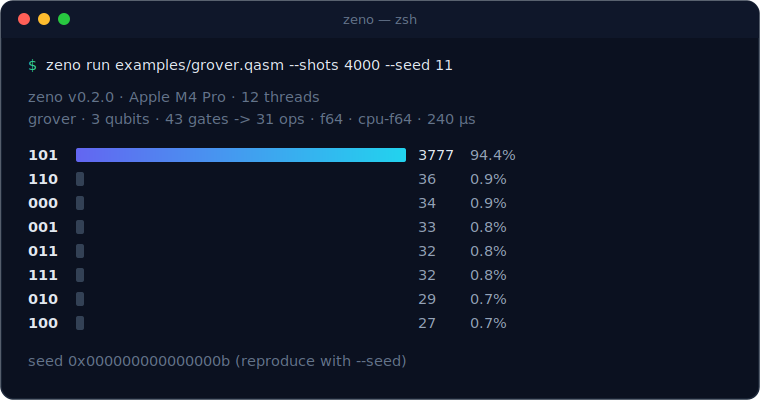
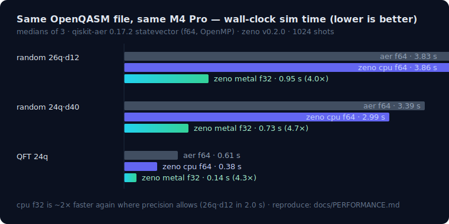
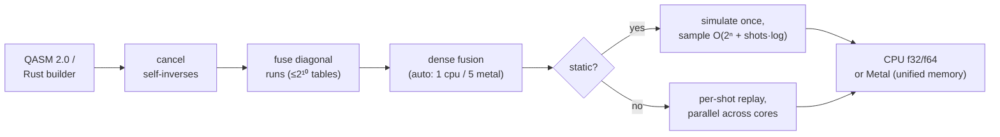

<p align="center">
  
</p>

<p align="center">
  <a href="https://github.com/cleoanka/zeno/actions/workflows/ci.yml"></a>
  
  
  
</p>

**zeno** is a quantum circuit simulator, compiler and runner built for one
platform and tuned like it: Apple Silicon. It matches or beats qiskit-aer on
the CPU at double precision, and its Metal backend runs deep circuits **4–5×
faster** than aer on the same machine — while every amplitude is
cross-validated against an independent reference and against qiskit itself.

> **Why "Zeno"?** After Zeno of Elea, the Greek philosopher who argued that
> if you slice time finely enough, a flying arrow never moves — and after the
> **quantum Zeno effect**, where observing a quantum system often enough
> freezes its evolution. A simulator is exactly that privileged observer: it
> can stop quantum motion at any instant, inspect every amplitude, and let
> the arrow fly again.

<p align="center">
  
</p>

## Highlights

- **Fast where it counts.** Split-complex (SoA) state vector, NEON-friendly
  run-walk kernels, rayon across all P+E cores, a compiler that fuses
  diagonal ladders into single sweeps and executes CX as a zero-arithmetic
  permutation. A 26-qubit, 462-gate circuit: **3.8 s f64 / 2.0 s f32 / 0.95 s
  Metal** on an M4 Pro.
- **A real GPU backend.** `--features metal` puts the state in unified
  memory: the GPU sweeps gates, the CPU samples the same bytes — zero copies.
  Same seed and fusion setting ⇒ **bit-identical counts** to the CPU
  backend (tested, including across the command-buffer rollover path).
- **RAM-aware by design.** `zeno info` tells you exactly how many qubits
  your machine holds; runs auto-select f64/f32 per budget and refuse
  politely (with the capacity table) instead of swap-storming. 24 GB ⇒ 30
  qubits f64 / 31 qubits f32.
- **OpenQASM 2.0 and 3 front ends** with line:col errors, broadcasting,
  user-defined gates and classical control (the version header picks the
  parser) — plus a clean Rust builder API.
- **Noise, when you want it.** Trajectory-sampled depolarizing, bit/phase
  flip, amplitude damping and readout error via `--noise` — cross-validated
  against qiskit-aer's noise models ([docs/NOISE.md](docs/NOISE.md)).
- **Friendly from minute zero.** `zeno demo` runs and explains six built-in
  circuits with no files at all, and
  [docs/TUTORIAL.md](docs/TUTORIAL.md) takes a complete beginner from
  "what is a qubit" to writing their own circuit in 15 minutes.
- **Trust, not vibes.** An independently written dense reference simulator
  gates every kernel and every native gate in every argument order; 60+
  circuits cross-validated against qiskit-aer to max |Δamp| < 1e-9; all
  unsafe kernels have written disjointness proofs and were stress-tested at
  1/3/16 threads. 270 tests on the full Metal build (261 CPU-only), clippy-clean, CI on Apple Silicon.

## Benchmarks

<p align="center">
  
</p>

| circuit (same .qasm file) | qiskit-aer f64 | zeno cpu f64 | zeno metal f32 |
|---|---|---|---|
| random 20q · depth 12 | 64 ms | **40 ms** | — |
| random 26q · depth 12 | 3.83 s | 3.86 s | **0.95 s** |
| random 24q · depth 40 | 3.39 s | **2.99 s** | **0.73 s** |
| QFT 24q | 607 ms | **258 ms** | **140 ms** |

M4 Pro, medians of 3, identical files, methodology + full tables in
[docs/PERFORMANCE.md](docs/PERFORMANCE.md). Dynamic circuits run at
**13.6 M shots/s** (teleportation, 1M shots). Numbers were produced by an
adversarial perf review — including the ones that made us change our own
defaults.

## Install

```sh
git clone https://github.com/cleoanka/zeno
cd zeno
cargo install --path .              # CPU backend
cargo install --path . --features metal   # + Metal GPU backend
```

Requires Rust 1.80+ (`brew install rust` or rustup) on Apple Silicon macOS.
The build uses `-C target-cpu=native`, so the kernels are scheduled for your
exact chip.

## Use it in 10 seconds

No files, no setup — `zeno demo` explains what it runs as it runs it:

```sh
zeno demo            # a Bell pair, explained
zeno demo --list     # ghz, qft, grover, teleport, noisy ...
```

Then run real circuits:

```sh
zeno run examples/bell.qasm --shots 1000 --seed 42
```

```
zeno v0.2.0 · Apple M4 Pro · 12 threads
bell · 2 qubits · 2 gates -> 2 ops · f64 · cpu-f64 · 184 µs

  00  ▇▇▇▇▇▇▇▇▇▇▇▇▇▇▇▇▇▇▇▇▇▇▇▇▇▇▇▇▇▇  502   50.2%
  11  ▇▇▇▇▇▇▇▇▇▇▇▇▇▇▇▇▇▇▇▇▇▇▇▇▇▇▇▇▇▇  498   49.8%

seed 0x000000000000002a (reproduce with --seed)
```

The four subcommands:

```sh
zeno demo [NAME]                  # built-in circuits, explained (start here)
zeno run circuit.qasm [--shots N] [--seed S] [--precision f32|f64]
        [--backend cpu|metal] [--fusion K] [--mem-limit 8g] [--threads N]
        [--noise SPEC] [--statevector] [--json]   # simulate + histogram
zeno info                         # your machine's qubit capacity
zeno bench --qubits 20,24,26      # reproducible throughput sweep
zeno compile circuit.qasm         # see what the fusion compiler did
```

`--noise` accepts inline JSON, `key=value` pairs
(`--noise bit_flip=0.01,readout_flip_1to0=0.02`) or a JSON file — semantics
in [docs/NOISE.md](docs/NOISE.md).

`--json` everywhere for scripting; every run prints its seed so any
histogram is replayable bit-for-bit.

### How many qubits do I get?

State vectors double per qubit: `2ⁿ` amplitudes × 8 B (f32) or 16 B (f64).
`zeno info` computes it live; the default budget is 75% of RAM
(`--mem-limit` / `ZENO_MEM_BYTES` override):

| RAM | f64 | f32 |
|---|---|---|
| 8 GB | 28 | 29 |
| 16 GB | 29 | 30 |
| 24 GB | 30 | 31 |
| 64 GB | 31 | 32 |
| 128 GB | 32 | 33 |

If f64 doesn't fit but f32 does, zeno switches automatically and tells
you. A 29-qubit GHZ (8 GiB of amplitudes) runs end-to-end in ~9 s.

## Rust API

```rust
use zeno::{Circuit, Simulator};

let mut c = Circuit::new(3);
c.h(0).cx(0, 1).cx(1, 2).measure_all();          // GHZ

let r = Simulator::new().shots(4096).seed(7).run(&c).unwrap();
println!("{:?}", r.counts.probabilities());       // 000: ~0.5, 111: ~0.5

let psi = Simulator::new().statevector(&c).unwrap();  // full state, C64
```

Everything the CLI can do, the library can do (`RunOptions`, `run_qasm_str`,
`Program` for multi-register/classically-controlled circuits). Docs:
`cargo doc --open`.

## OpenQASM 2.0

Registers, `measure`/`reset`/`barrier`, `if (creg == n)`, user-defined gates
(inline-expanded), register broadcasting, parameter expressions
(`pi`, `+ - * / ^`, `sin/cos/tan/exp/ln/sqrt`), and a 35-gate native set
(`qelib1` superset — `u3, cx, ccx, cswap, rzz, rxx, …`). Parse errors carry
exact line:col and name what was expected:

```
line 4:1: unknown gate 'H' (gate names are case-sensitive; did you mean 'h'?)
```

Full support matrix and the (documented) spec deviations:
[docs/QASM.md](docs/QASM.md) for 2.0 and [docs/QASM3.md](docs/QASM3.md) for
the OpenQASM 3 subset (`qubit[n]`/`bit[n]`, both measure forms, `if` blocks,
`stdgates.inc` aliases — the version header dispatches automatically).
Six worked examples live in
[examples/](examples/) — Bell, GHZ-24, a self-checking QFT round trip,
Grover (94.5% in 2 iterations), teleportation with mid-circuit measurement,
and Bernstein–Vazirani.

## How it works



The interesting decisions — why amplitudes are stored split, why dense
fusion is *off* on the CPU but *on* for Metal, how sampling avoids per-shot
work, and the exact kernel invariants — are written up in
[docs/ARCHITECTURE.md](docs/ARCHITECTURE.md).

## Correctness

This repo treats "it looks right" as a bug. The test suite includes:

- an **independent reference simulator** (different storage, no fusion, no
  threads) that every native gate must match in **every argument order**,
  at every fusion level 0–6, in both precisions;
- closed-form checks (QFT phases against the DFT formula, GHZ, Grover
  amplitudes, teleportation statistics at 6σ);
- **qiskit cross-validation**: 60+ circuits, max |Δamp| < 1e-9 (f64),
  TVD < 0.01 at 100k shots — including dynamic circuits with `if`/`reset`;
- Metal ↔ CPU parity: identical counts at the same seed, including across
  the GPU command-buffer rollover path;
- a meta-test that injects a sign error to prove the harness *would* catch
  one (it does).

The reference suite has already paid for itself: it caught a control-bit
convention bug in `crz` before release.

## Roadmap

Shipped in v0.2.0 (every claim measured, see [docs/PERFORMANCE.md](docs/PERFORMANCE.md)):

- ~~Explicit NEON kernels~~ — **done.** The dense fused kernel is vectorized
  across groups (1.7–2.9× at fusion 5), the diagonal kernel streams at DRAM
  bandwidth (QFT-24: 1.5–1.7× end to end), all bit-identical to the scalar
  paths by construction (`to_bits`-equality tests).
- ~~Threadgroup-memory fused kernel for Metal~~ — **measured and closed.**
  Best tuning reached 1.08×, below our 1.10× merge bar (Apple's cache
  hierarchy already serves the uniform matrix reads); the experiment and
  numbers are documented in `src/metal.rs` so it isn't blindly retried.
- ~~Noise channels~~ — **done.** Trajectory-sampled depolarizing, bit/phase
  flip, amplitude damping and readout error, cross-validated against
  qiskit-aer noise models to TVD < 0.004 at 100k shots
  ([docs/NOISE.md](docs/NOISE.md)).
- ~~OpenQASM 3 front end~~ — **done** (documented subset, auto-detected from
  the version header; [docs/QASM3.md](docs/QASM3.md)).

Next:

- OpenQASM 3 classical control: `for` loops and subroutines.
- An exact density-matrix backend for noise (trajectories are exact per
  model but sampling-based; a density matrix trades qubits for exactness).
- Wider CPU fusion revisit: NEON made fused ops 1.7–2.9× faster, but the
  1-qubit sweeps still win at the default sizes — the break-even now sits
  closer and deserves a systematic sweep.

## License

MIT © 2026 [cleoanka](https://github.com/cleoanka)
